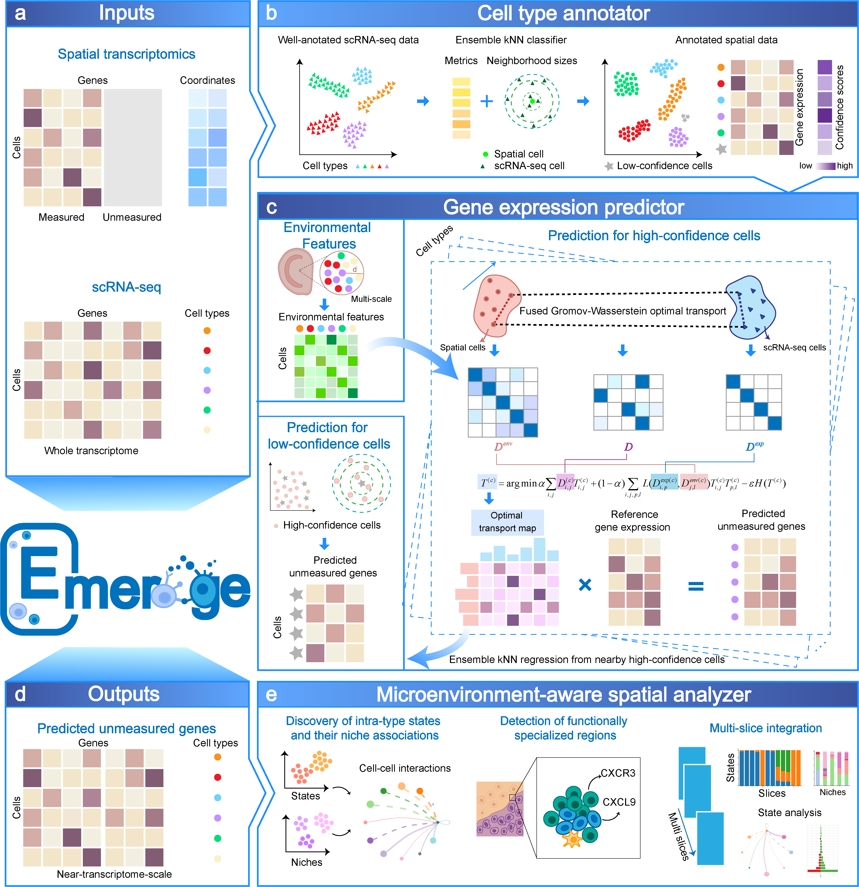

# Emerge reconstructs transcriptome-scale spatial maps to reveal microenvironmental regulation of cell states

**Emerge** is a Python toolkit for integrates targeted spatial assays with matched single-cell RNA-seq references to reconstruct transcriptome-scale profiles. By constraining alignment within reference-defined types and embedding local niche composition, Emerge achieves identity-preserving, context-aware inference. Across brain and breast cancer tissues, it consistently out-performed existing methods in predictive accuracy, spatial fidelity, and recovery of intra-type diversity. Importantly, Emerge uncovered biological programs beyond the reach of targeted panels or prior computational approaches, including niche-stratified astrocyte states, stromal subsets orchestrating immune hubs, and fibroblast plasticity linked to epithelial–mesenchymal transition. By bridging transcriptome-scale inference with spatial context, Emerge establishes a methodological and translational platform for decoding environment-driven regulation of cell states in health and disease.


## Installation

Emerge targets Python 3.9 or newer. The recommended way to install the package is via `pip`
from a local clone:

```bash
# Clone the repository
git clone https://github.com/your/repo.git
cd Emerge

# (Optional) create and activate a virtual environment
python -m venv .venv
source .venv/bin/activate

# Install the package in editable mode
pip install -e .

# (Optional) Install the package without dependency 
pip install -e . --no-deps
```

The installation pulls in the required scientific Python stack, including `numpy`, `pandas`,
`scanpy`, `anndata`, `scikit-learn` and the POT optimal transport library. If you plan to run
the tutorial notebooks, ensure that Jupyter is available in your environment as well.


## Tutorials

We provide source codes for reproducing the **Emerge** analysis in the main text in the `demo` directory.

- [Cross valadation in MOp dataset](demo/mop_cross_validation.ipynb)
- [Unmeasured gene expression prediction and microenvironment-aware spatial analysis in MOp dataset](demo/emerge_mop_un.ipynb)


## Dataset
All datasets analyzed in this study are publicly available.  
For user convenience, we host the processed data on **Zenodo**:  
[10.5281/zenodo.17214560](https://doi.org/10.5281/zenodo.17214560)


## Contact

Please contact Miss **Yang Shi-Tong** (<styang@mails.ccnu.edu.cn>) or Dr. **Xiao-Fei Zhang**
(<zhangxf@mail.ccnu.edu.cn>) for questions about the repository and the algorithm.


